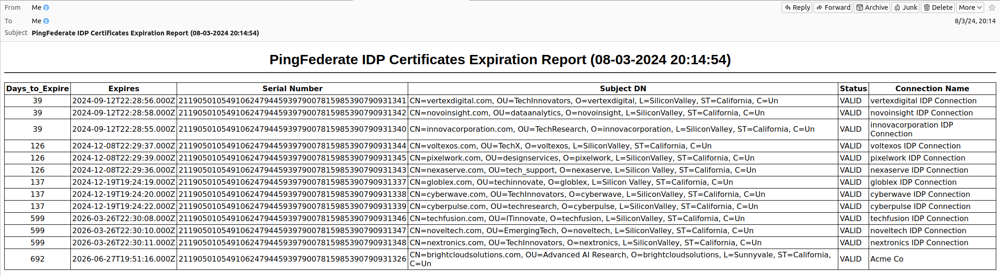

# PingFederate Certificate Expiration Report Creator

## 📝 About
This script was developed as a personal project in my home Ping Identity home lab as a way to learn the Ping Federate API. I formerly had this in a private Python repo but decided to move it to its own public repo.  It is licensed under the MIT License to ensure maximum usability for anyone who finds it helpful.  This script was created entirely on my own time and resources, independent of my professional role.

## 🎯 Script Purpose

The `pingfed-cert-report.py` script is a utility designed to generate detailed reports on the certificates used in a PingFederate environment. It interacts with the PingFederate Admin API to retrieve certificate data, analyze expiration details, and produce customizable reports. Key features include:

- **Certificate Types Supported**:
  - SSO signing certificates
  - SSL server certificates
  - CA certificates
  - SP (Service Provider) connection certificates
  - IDP (Identity Provider) connection certificates

- **Output Options**:
  - Reports can include JSON and/or CSV attachments, or no attachments, based on user preference.
  - Certificates are sorted by expiration date for clarity.

- **Customization and Extensibility**:
  - Ability to specify PingFederate instance details, API credentials, and admin email recipients.
  - Integration of expiration details and organizational information into the reports.

- **Error Handling and Validation**:
  - Ensures the existence of required CA certificate files.
  - Provides informative messages for missing or incorrect configurations.

This script is ideal for administrators and engineers who need to monitor certificate expiration proactively and ensure uninterrupted operation of their PingFederate deployments.


## 📜 License
This project is licensed under the MIT License. You are free to use, modify, and distribute this code with attribution to the original author.

## 🕒 Version History

| Version | Date       | Changes                                                                                   |
|---------|------------|-------------------------------------------------------------------------------------------|
| 2.4     |Aug 3, 2024| Added support for IDP connection certificates. Enhanced sorting by days to expire.        |
| 2.3     |Jul 28, 2024| Improved argument handling by displaying help when no arguments are passed.               |
| 2.2     |Jul 28, 2024| Introduced 'none' as an output type, and replaced JSON with a pretty JSON attachment.      |
| 2.1     |Jul 28, 2024| Added validation for CA certificate file existence and enhanced error handling.           |
| 2.0     |Jul 28, 2024| Added support for SP connections and an additional "Connection Name" column in reports.   |
| 1.0     |Apr 10, 2023| Initial version of the script.                                                           |


## 🛠️ Requirements

### Python Version 
The script requires **Python 3.6+** 🐍
- `logging`, `logging.handlers` (built-in)
- `requests` and `requests.auth` (requires installation)
- `json` (built-in)
- `subprocess` (built-in)
- `email.mime.text`, `email.mime.multipart` (built-in)
- `datetime` (built-in)
- `argparse` (built-in)
- `getpass` (built-in)
- `signal` (built-in)
- `os` and `sys` (built-in)

Make sure to install all necessary dependencies using `pip`:
```bash
pip install requests
```
### CA Certificate Configuration
The `ca_cert_file` variable must be set to the path of the CA certificate file on the local system. This certificate is used to validate the SSL connection to the PingFederate API. Below are common paths for CA certificate files on supported Linux systems:

- **Red Hat Enterprise Linux (RHEL) 8/9**:
  - `/etc/pki/tls/certs/ca-bundle.crt`
  - `/etc/pki/ca-trust/extracted/pem/tls-ca-bundle.pem`

- **Ubuntu 20.04/22.04**:
  - `/etc/ssl/certs/ca-certificates.crt`
  - `/usr/local/share/ca-certificates/<custom-ca>.crt`

### Example Configuration
Update the `ca_cert_file` variable in the script as shown below:
```python
ca_cert_file = '/etc/ssl/certs/ca-certificates.crt'  # Example for Ubuntu
```

If your system uses a non-standard or custom path and/or file for the CA certificate, ensure the correct path and file name is specified and the file is accessible to the script.


## 🚀 Execution
```
./pingfed-cert-report.py idp https://pf1.example.com:9999/pf-admin-api/v1/ Administrator admin@example.com none

./pingfed-cert-report.py idp https://pf1.example.com:9999/pf-admin-api/v1/ Administrator admin@devops1.example.com both
```

## ❓ Help
```
./pingfed-cert-report.py 
usage: pingfed-cert-report.py [-h] {signing,sslserver,ca,sp,idp} pingfederate_url pingfederate_username admin_email {both,json,csv,none}

PingFederate Certificate Expiration Report Generator

positional arguments:
  {signing,sslserver,ca,sp,idp}
                        Certificate type to report on:
                          signing   - SSO signing certificates
                          sslserver - SSL server certificates
                          ca        - CA certificates
                          sp        - SP connection certificates
                          idp       - IDP connection certificates
  pingfederate_url      PingFederate API URL
                        Example: https://<PingFed Admin URL>:9999/pf-admin-api/v1/
  pingfederate_username
                        PingFederate API username
  admin_email           One or more comma-separated admin email addresses
  {both,json,csv,none}  Type of file attachment(s) to include in the email:
                          both - Include both JSON and CSV attachments
                          json - Include only the JSON attachment
                          csv  - Include only the CSV attachment
                          none - Do not include any attachments

options:
  -h, --help            show this help message and exit
```

## 📧 Example Email Results
IDP Certificate Expiration Report


## Keywords
Ping Federate, PingFederate, PingFederate API, PingIdentity, certificate expiration report, certificate monitoring, Python PingFederate script, SSL certificate report, SSO certificate management, SP connection certificates, IDP connection certificates, PingFederate Admin API, Python automation, certificate expiration tracker, JSON certificate reports, CSV certificate reports, Python script for Ping Identity, API integration, certificate validation, Ping Identity lab tools, automated certificate management, certificate report generator, certificate expiration notifier, Identity and Access Management, Single Sign-On, SAML authentication, OAuth 2.0, Zero Trust security, IAM

